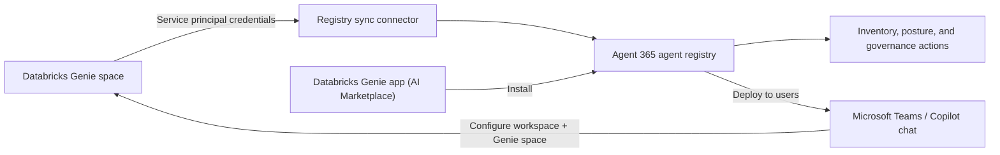

# 🧬 Onboarding Databricks Genie

[🏠 Back to Home](../README.md)

> **Databricks Genie** spaces run entirely inside your Databricks workspace, outside the Microsoft ecosystem. To bring them under the same governance umbrella as `Wildpaws Trail Guide` and `Sous Snark`, you connect Databricks to **Agent 365** using **Registry sync**. This pulls Genie's agent metadata into the Agent 365 agent registry for centralized visibility and governance, without moving or redeploying anything in Databricks.

## Video Tutorial

> ▶️ [Watch the walkthrough on YouTube](https://youtu.be/0GdsjFWNP5s)

---

## Index

- [What you'll build](#what-youll-build)
- [Prerequisites](#prerequisites)
- [Step 1: Create a Databricks service principal](#step-1-create-a-databricks-service-principal)
- [Step 2: Grant the service principal admin access to the workspace](#step-2-grant-the-service-principal-admin-access-to-the-workspace)
- [Step 3: Connect Databricks Genie in Registry sync](#step-3-connect-databricks-genie-in-registry-sync)
- [Step 4: Sync and review the imported agents](#step-4-sync-and-review-the-imported-agents)
- [Step 5: Install Databricks Genie from the AI Marketplace and configure it in Teams](#step-5-install-databricks-genie-from-the-ai-marketplace-and-configure-it-in-teams)
- [Verify the connection](#verify-the-connection)
- [Reference](#reference)

## What you'll build

By the end of this chapter:

- Databricks Genie is a **connected platform** in Agent 365 Registry sync.
- Genie agents show up in the **Agent 365 agent registry**, alongside `Wildpaws Trail Guide` and `Sous Snark`.
- The AI Admin can monitor sync status and apply the governance actions the Databricks API supports, all from the Microsoft 365 admin center.
- The **Databricks Genie** app is installed from the AI Marketplace and made available to end users in Teams and Microsoft 365 Copilot.
- End users **configure** the app with their Databricks workspace and Genie space, then chat with their data directly in Teams.

> **Preview note:** Registry sync is a **preview** feature. It isn't intended for production use yet and is covered by the [supplemental terms of use](https://learn.microsoft.com/legal/microsoft-365/supplemental-terms) for previews.

## Prerequisites

- Your organization is **onboarded to Microsoft Agent 365** (see [Chapter 4: Agent 365](../Chapter%204%20Agent%20365/Agent-365-Custom-Template.md)).
- A Microsoft 365 admin role that can manage the agent registry (for example, **Global Administrator**).
- A **Databricks workspace** with an existing Genie space, and account-level access to create a service principal.
- The workspace's **Workspace URL** (from the Databricks portal address bar).

## Step 1: Create a Databricks service principal

Registry sync authenticates to Databricks as a service principal, not a user, so create one dedicated to this connection.

1. Sign in to the [Databricks account console](https://accounts.azuredatabricks.net/) (or your account console URL).
2. Go to **User management** > **Service principals** > **Add service principal**.
3. Give it a descriptive name, for example `agent365-registry-sync`, then select **Add**.
4. Open the new service principal, go to **Secrets**, and select **Generate secret**.
5. Copy and store the **Client ID** (Application ID) and **Client Secret** immediately. The secret is shown only once.

## Step 2: Grant the service principal admin access to the workspace

Registry sync needs the service principal to have admin access in the target workspace so it can list and read Genie agents.

1. In the Databricks account console, go to **Workspaces**, select the workspace that hosts your Genie space, and open its **Permissions**.
2. Add the service principal created in Step 1 and assign it the **Admin** role for the workspace.
3. If the workspace uses Unity Catalog, also confirm the service principal has `CAN_USE` access to the Genie space and any SQL warehouse it depends on.

## Step 3: Connect Databricks Genie in Registry sync

1. Open the [Microsoft 365 admin center](https://admin.microsoft.com/Adminportal/Home#/homepage).
2. In the navigation pane, select **Agents** > **All Agents** to open the agent registry.
3. In the **Registry sync** web part, select **Manage**.
4. Select **+ Connect a platform**.
5. Enter a connection name (for example, `Databricks Genie - Prod`) and a short description.
6. For **Platform**, select **Databricks Genie**.
7. Select the **region** where your Databricks workspace is deployed.
8. Choose whether to **import agents automatically** on future syncs.
9. Enter the authentication credentials from Steps 1-2:
   - **Workspace URL**
   - **Client ID** (service principal Application ID)
   - **Client Secret**
10. Select **Validate** to confirm Agent 365 can reach the workspace and authenticate.
11. Select **Save** to create the connection.

## Step 4: Sync and review the imported agents

1. On the **Registry sync** page, select your new Databricks connection.
2. Select **Sync agents** to trigger the first synchronization.
3. Open the connection's details to review:
   - Platform provider and region
   - Last run date and last sync status
   - Total synced agents
   - Synchronization results (including any errors to resolve)
4. Repeat **Sync agents** any time you add or change Genie spaces in Databricks. Scheduled, automatic syncs are planned for a future release.

## Step 5: Install Databricks Genie from the AI Marketplace and configure it in Teams

Registry sync (Steps 1-4) gives the AI Admin **visibility and governance** over Genie agents that already run in Databricks. To let end users actually **chat** with Genie inside Microsoft 365, install the **Databricks Genie** app from the AI Marketplace, then have each user connect it to their workspace.

### 5a. Install the app from the AI Marketplace

1. Open the [Microsoft 365 admin center](https://admin.microsoft.com/Adminportal/Home#/homepage).
2. In the navigation pane, select **Agents** > **Marketplace**.
3. Search for **Databricks Genie** and select the app card. It's published by **Databricks Inc.** as a **Third party** agent.
4. Review the **About this agent** details, including the description, publisher, and permissions, then select **Get it now** (or **Install**).
5. Choose which users or groups the app is **available to**, and optionally which users have it **pre-installed**, then confirm the install.
6. Once installed, the app appears in **Agents** > **All agents**, with **Publisher type: Third party**, **Publisher: Databricks Inc.**, and channel icons for **Teams** and **Microsoft 365 Copilot**.

> This install step is a Marketplace deployment for **end-user consumption**, separate from the Registry sync connection in Steps 1-4, which exists purely for **admin visibility and governance**. Both can be used together: Registry sync tracks the Genie spaces running in Databricks, while the Marketplace app gives users a chat surface in Teams and Copilot.

### 5b. Configure the app for a chat in Teams

1. In **Microsoft Teams**, open a chat with the **Databricks Genie** app (search for it in the app bar or **Apps** if it isn't pinned yet).
2. Send any message. The agent replies with **"Connect your Databricks workspace and Genie Agent for this chat"** and a **Configure** button.
3. Select **Configure** and provide:
   - The **Databricks workspace URL** to connect to.
   - The **Genie space** (or Genie Agent) to route questions to for this chat.
4. Save the configuration. Each Teams chat or channel can be connected to a different Genie space, so different teams can pin the space relevant to their data domain.
5. Ask a question in natural language, for example "What are our top 5 customers by total spend?". Databricks Genie answers **inside Teams**, citing its sources (the **Genie Space** and the underlying **SQL Query**/**Query Result**).

## Verify the connection

- The Databricks connection shows a **Last sync status** of success on the **Registry sync** page.
- Your Genie agent(s) now appear in the Agent 365 **agent registry**, listed alongside your Copilot Studio and Foundry pilot agents.
- Selecting a synced Genie agent shows its basic metadata and the governance actions currently supported by the Databricks API.
- The **Databricks Genie** Marketplace app shows **Available** in **Agents** > **All agents**, with channel icons for **Teams** and **Microsoft 365 Copilot**.
- In Teams, a configured chat answers data questions and shows **Sources** (Genie Space and SQL Query) under each response.

With Databricks Genie synced into the registry and installed for end users, the AI Admin has one inventory that spans Copilot Studio, Foundry, and Databricks, and end users have a governed way to chat with their Databricks data directly in Teams.

## Reference

- [Registry sync in the Microsoft 365 agent registry (preview)](https://learn.microsoft.com/microsoft-agent-365/admin/agent-registry)
- [Connect existing agents to Microsoft Agent 365](https://learn.microsoft.com/microsoft-agent-365/connect-existing-agents)
- [Governance and Lifecycle actions for agents (Install, Uninstall, Block)](https://learn.microsoft.com/microsoft-365/admin/manage/agent-actions)
- [Manage agent registry in Microsoft 365 admin center (Marketplace)](https://learn.microsoft.com/microsoft-365/admin/manage/agent-registry)
- [Databricks service principals](https://docs.databricks.com/)
- [Overview of Microsoft Agent 365](https://learn.microsoft.com/microsoft-agent-365/overview)

---

[🏠 Back to Home](../README.md)
