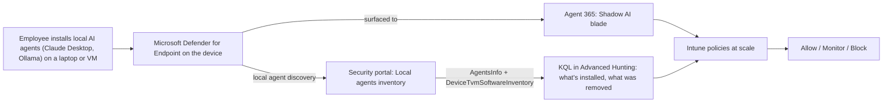

# Discovering Shadow AI Agents

[🏠 Back to Home](../README.md)

> Acting as your SOC, you hunt for shadow AI: the AI agents employees install on their own laptops and VMs (Claude Desktop, Ollama, and similar). Agent 365 governs the agents *you* build and publish; local agents live outside that boundary until discovery surfaces them. In this chapter you'll see how those local agents show up in the Security portal through Microsoft Defender for Endpoint, and also in the Agent 365 Shadow AI blade. Through this scenario, you will be able to query the agents installed, check if they were removed, and apply Intune policies at scale to allow/monitor/block.

---

## Index

- [What you'll build](#what-youll-build)
- [Prerequisites](#prerequisites)
- [The scenario](#the-scenario)
- [How local agents show up in the Security portal](#how-local-agents-show-up-in-the-security-portal)
- [Scenario 1: Did users actually remove the agents the SOC asked them to?](#scenario-1-did-users-actually-remove-the-agents-the-soc-asked-them-to)
- [What the query does, step by step](#what-the-query-does-step-by-step)
- [Turn it into a scheduled outreach list](#turn-it-into-a-scheduled-outreach-list)
- [Scenario 2: Block an agent at scale with Intune](#scenario-2-block-an-agent-at-scale-with-intune)
- [Reference](#reference)

## What you'll build



By the end of this chapter you'll be able to:

- Explain how locally installed AI agents are discovered and where they appear in the Microsoft Defender portal.
- Cross-reference discovery against software inventory to tell *still installed* apart.
- Produce a triage-ready outreach list (device + user account) the SOC can act on every 24 hours.

## Prerequisites

- Chapter 5 is complete: Agent 365 is connected to Microsoft Defender, so agent data flows into the Defender portal. See [Connecting Agent 365 to the Security Portal](../Chapter%205%20Security%20Portal/Connecting-Agent-365-to-the-Security-Portal.md).
- Local AI agent discovery is enabled and the target devices are onboarded to Microsoft Defender for Endpoint, so both `AgentsInfo` (with `Platform == "LocalAgents"`) and `DeviceTvmSoftwareInventory` are populated for them.
- A Microsoft Defender role that can run Advanced Hunting queries (for example, Security Reader to read, or Security Operator/Administrator to also create custom detections).

## The scenario

To pilot this end to end, we stood up a test machine called `shadowaiagent` and, acting as an employee going around IT, installed two local AI agents on it:

- Claude Desktop (Anthropic)
- Ollama

Within a short time both were discovered by Defender for Endpoint and appeared in the Local agents inventory in the Security portal, each with its own raw metadata (device name, vendor, the signed-in user account, and the related process). So far, so good: this is exactly what shadow AI discovery is for, seeing the agents nobody registered.

Then we tested the removal path. We uninstalled Claude Desktop from `shadowaiagent` and left Ollama in place.

## How local agents show up in the Security portal

Local AI agents are discovered by Defender for Endpoint on the device itself, not through Agent 365. They surface in two places you'll use here:

1. The Local agents inventory (UI). In the Defender portal, discovered local agents appear in the assets/agents inventory with a per-agent record you can open to see the raw logs: the device it was found on, the vendor, the version, the user account, and the related process.
2. The `AgentsInfo` table (Advanced Hunting). The same discovery data is queryable with KQL. Local agents are the rows where `Platform == "LocalAgents"`, and the useful device/user detail lives inside a nested metadata bag:

   ```kql
   // What a single local-agent record looks like
   AgentsInfo
   | where Platform == "LocalAgents"
   | summarize arg_max(Timestamp, *) by AgentId
   | extend meta = RawAgentInfo.localAgentMetadata
   | project Timestamp, Name, Version,
             Vendor      = tostring(meta.vendor),
             DeviceName  = tostring(meta.deviceName),
             UserAccount = tostring(meta.accountName),
             UserDomain  = tostring(meta.accountDomain),
             AgentId
   | sort by Timestamp desc
   ```

## Scenario 1: Did users actually remove the agents the SOC asked them to?

The SOC asked a set of users to uninstall the local AI agents they had installed. Now you need to verify who actually did it. This query returns the local AI agents that are still installed on their device (a discovery record backed by a matching entry in software inventory), with the device and user so the SOC can follow up with the people who haven't removed them yet. In the pilot it correctly returned only Ollama Desktop; Claude, which was genuinely uninstalled, dropped out.

```kql
// Local AI agents that are ACTUALLY still installed (discovery cross-checked against software inventory).
// Returns device + user so the SOC can contact the person and allow / monitor / ask to remove.
let installed =
    DeviceTvmSoftwareInventory
    | project DeviceName, SwVendor = tolower(SoftwareVendor), SwName = tolower(SoftwareName);
AgentsInfo
| where Platform == "LocalAgents"
| where Timestamp > ago(7d)
| summarize arg_max(Timestamp, *) by AgentId
| extend meta = RawAgentInfo.localAgentMetadata
| extend DeviceName  = tostring(meta.deviceName),
         Vendor      = tolower(tostring(meta.vendor)),
         AgentToken  = tolower(replace_string(tostring(Name), " Desktop", ""))  // "claude", "ollama"
| join kind=inner installed on DeviceName
| where SwVendor has Vendor or SwName has AgentToken or SwName has Vendor
| summarize arg_max(Timestamp, *) by AgentId   // dedupe after the join fan-out
| extend meta = RawAgentInfo.localAgentMetadata
| project
    LastSeen    = Timestamp,
    Agent       = Name,
    Version,
    Vendor      = tostring(meta.vendor),
    DeviceName  = tostring(meta.deviceName),
    UserAccount = tostring(meta.accountName),
    UserDomain  = tostring(meta.accountDomain),
    AgentId
| sort by DeviceName asc, Agent asc
```

## What the query does, step by step

- `let installed = DeviceTvmSoftwareInventory | project ...` builds the ground-truth list of what is installed on each device, lowercasing the vendor and software name so the later comparison is case-insensitive.
- `AgentsInfo | where Platform == "LocalAgents"` limits to locally discovered agents (not Agent 365-managed ones).
- `where Timestamp > ago(7d)` looks at the last 7 days of discovery snapshots (tune to your tenant).
- `summarize arg_max(Timestamp, *) by AgentId` keeps only the latest snapshot per agent, so an agent isn't counted once per snapshot.
- `extend meta = RawAgentInfo.localAgentMetadata` pulls out the nested metadata bag (device, vendor, user account).
- `extend DeviceName / Vendor / AgentToken` derives the join and match keys. `AgentToken` strips `" Desktop"` from the agent name so `Name = "Claude Desktop"` becomes the token `claude` (and `"Ollama Desktop"` becomes `ollama`) to match how the app is listed in software inventory.
- `join kind=inner installed on DeviceName` joins each discovered agent to the software installed on its own device. `inner` drops any agent whose device has no software-inventory match at all.
- `where SwVendor has Vendor or SwName has AgentToken or SwName has Vendor` is the crucial check: it keeps a row only if the agent's own app (by vendor or name token) is actually present in software inventory on that device. This is what makes uninstalled Claude fall away: its config artifacts still trigger discovery, but there is no matching Claude entry in `DeviceTvmSoftwareInventory`, so it fails this filter. (An earlier version of this query joined on `DeviceName` alone, which wrongly kept *every* agent on any device that had *any* software installed. This per-agent match is the fix.)
- `summarize arg_max(Timestamp, *) by AgentId` de-duplicates after the join, since one agent can match several software rows and fan out.
- `project ...` shapes the outreach columns: last seen, agent, version, vendor, device, and the user account/domain to contact.
- `sort by DeviceName asc, Agent asc` orders the list by device then agent for easy scanning.

> [!IMPORTANT]
> Net effect: the output is the set of local AI agents that are genuinely still installed, per device, with the person to contact.

## Turn it into a scheduled outreach list

Once the query is validated in your tenant, save it and run it on a cadence so the SOC gets a fresh outreach list automatically:

1. With the query in the editor, select Save > Save as (for example, `Shadow AI - local agents still installed`).
2. To alert automatically, select Create detection rule and set the Frequency (for example, every 24 hours), a clear Alert title, severity, and map Impacted entities (device and user) so alerts are actionable.
3. The SOC uses the resulting list to contact each user and decide whether to allow, monitor, or ask them to remove the local agent.

## Scenario 2: Block an agent at scale with Intune

Outreach works for the cooperative users. For the rest, you can stop a shadow AI agent from running across the fleet without touching each machine. The Agent 365 Shadow AI blade turns a block decision into a Microsoft Intune policy that propagates to every managed Windows device enrolled in Intune, so you go from *discovered* to *blocked* in a few clicks.

### 2a. Review the detection in the Shadow AI blade

1. In the Microsoft 365 admin center, open the Shadow AI experience and select the detected agent (for example, `OpenClaw`).
2. On the agent details pane, open the Detected devices tab to confirm scope: device name, Model (Desktop, Virtual Machine, Server, Laptop), operating system, and Last seen. This is the set of machines the block will target.

### 2b. Apply the block policy

1. On the agent details pane, select Security policies.
2. Under Security policies, select Block > Apply Policies.
3. This creates a new Intune policy named `A365 - Block <agent>` (for example, `A365 - Block OpenClaw`) that automatically propagates to all managed Windows devices enrolled in Intune. It blocks the common ways of running the agent.
4. Depending on how Intune is configured, propagation can take from 15 minutes up to 8 hours. You can find the policy in Intune under [Assign policies in Microsoft Intune](https://learn.microsoft.com/intune/device-configuration/assign-device-profile) and edit it to add further controls (for example, scope tags or assignment groups for a phased rollout).

### 2c. Choose allow, monitor, or block per agent

Use the outreach list from Scenario 1 to decide, per agent, whether to allow (sanctioned tool, leave it), monitor (keep discovering and watch usage), or block (push the Intune policy above). Sanctioned agents stay discoverable so you keep visibility even when you don't block them.

## Reference

- [Advanced hunting overview (Microsoft Defender XDR)](https://learn.microsoft.com/defender-xdr/advanced-hunting-overview)
- [`AgentsInfo` table (Agent and local agent inventory)](https://learn.microsoft.com/defender-xdr/advanced-hunting-agentsinfo-table)
- [`DeviceTvmSoftwareInventory` table](https://learn.microsoft.com/defender-xdr/advanced-hunting-devicetvmsoftwareinventory-table)
- [Kusto Query Language (KQL) in advanced hunting](https://learn.microsoft.com/defender-xdr/advanced-hunting-query-language)
- [AI agent inventory in Microsoft Defender XDR](https://learn.microsoft.com/defender-xdr/security-for-ai/ai-agent-inventory)
- [Shadow AI in Microsoft 365 admin center (Preview)](https://learn.microsoft.com/microsoft-365/admin/manage/agent-shadow-ai)
- [Local AI agent discovery with Microsoft Defender for Endpoint](https://learn.microsoft.com/defender-endpoint/local-agent-discovery-overview)
- [Assign policies in Microsoft Intune](https://learn.microsoft.com/intune/device-configuration/assign-device-profile)
- [Supported operating systems and browsers in Intune](https://learn.microsoft.com/intune/fundamentals/ref-supported-platforms)
- [How does Microsoft Defender support Agent 365?](https://learn.microsoft.com/microsoft-agent-365/leadership/defender-agent-365)

---

[🏠 Back to Home](../README.md)
