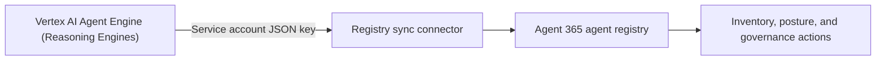

# 🟦 Onboarding Google Vertex Agents

[🏠 Back to Home](../README.md)

> [!WARNING]
> 🚧 **Work in Progress.** This chapter is being finalized. Steps and screenshots may change.

> **Google Vertex AI** agents run inside your Google Cloud project, outside the Microsoft ecosystem. To bring them under the same governance umbrella as `Wildpaws Trail Guide` and `Sous Snark`, you connect Google Vertex AI to **Agent 365** using **Registry sync**. This pulls the agents' metadata into the Agent 365 agent registry for centralized visibility and governance, without moving or redeploying anything in Google Cloud.

> [!NOTE]
> This chapter assumes your Vertex AI agents **already exist** in the pilot project. Agents must be deployed as **Vertex AI Agent Engine (Reasoning Engines)**, because the Registry sync connector discovers them through the `aiplatform.reasoningEngines.*` APIs. Agents that are not reasoning engines (for example, raw Gemini API calls or Dialogflow flows) do not appear in the registry.

---

## Index

- [What you'll build](#what-youll-build)
- [Prerequisites](#prerequisites)
- [Step 1: Create a Google Cloud service account](#step-1-create-a-google-cloud-service-account)
- [Step 2: Grant the service account the required role](#step-2-grant-the-service-account-the-required-role)
- [Step 3: Generate a service account JSON key](#step-3-generate-a-service-account-json-key)
- [Step 4: Connect Google Vertex AI in Registry sync](#step-4-connect-google-vertex-ai-in-registry-sync)
- [Step 5: Sync and review the imported agents](#step-5-sync-and-review-the-imported-agents)
- [Verify the connection](#verify-the-connection)
- [Reference](#reference)

## What you'll build



By the end of this chapter:

- Google Vertex AI is a **connected platform** in Agent 365 Registry sync.
- Your Vertex agents show up in the **Agent 365 agent registry**, alongside `Wildpaws Trail Guide` and `Sous Snark`.
- The AI Admin can monitor sync status and apply the governance actions the Vertex AI API supports, all from the Microsoft 365 admin center.

## Prerequisites

- Your organization is **onboarded to Microsoft Agent 365** (see [Chapter 4: Agent 365](../Chapter%204%20Agent%20365/Agent-365-Custom-Template.md)).
- A Microsoft 365 admin role that can manage the agent registry (for example, **Global Administrator**).
- A **Google Cloud project** with existing Vertex AI agents deployed as **Agent Engine (Reasoning Engines)**, and IAM permission to create a service account and role in that project.
- The **Vertex AI API** (`aiplatform.googleapis.com`) enabled on the project.
- The following values from your Google Cloud project, which you'll enter in Registry sync:
  - **Google Cloud region** where the agents are deployed (for example, `us-central1` / "US Central").
  - **Vertex AI project ID** (for example, `a365-vertex-agicku`).
  - A **service account JSON key** (created in Steps 1-3).
- *(Optional)* The **Google Cloud CLI** (`gcloud`) if you prefer to create the service account, role, and key from the command line instead of the Cloud Console.

## Step 1: Create a Google Cloud service account

Registry sync authenticates to Google Cloud as a service account, not a user, so create one dedicated to this connection.

**Console:** In the Google Cloud Console, go to **IAM & Admin** > **Service Accounts** > **+ Create service account**. Name it, for example, `a365-registry-sync`, then **Create and continue**.

**CLI:**

```powershell
gcloud iam service-accounts create a365-registry-sync `
  --project=<PROJECT_ID> `
  --display-name="Agent 365 Registry Sync"
```

## Step 2: Grant the service account the required role

The connector needs to **list**, **get**, and **delete** reasoning engines. You can grant either the predefined role or a least-privilege custom role.

**Option A - Predefined role (simplest):** assign **Vertex AI Administrator** (`roles/aiplatform.admin`) to the service account.

**Option B - Least-privilege custom role (recommended):** create a custom role that contains only the three permissions the connector uses, then bind it to the service account. This is preferred because the key leaves Google Cloud and is stored in Agent 365.

```powershell
# Create the least-privilege custom role
gcloud iam roles create a365RegistrySync `
  --project=<PROJECT_ID> `
  --title="A365 Registry Sync" `
  --description="Read/list/delete Vertex reasoning engines for Agent 365 sync" `
  --permissions="aiplatform.reasoningEngines.list,aiplatform.reasoningEngines.get,aiplatform.reasoningEngines.delete" `
  --stage=GA

# Bind the custom role to the service account
gcloud projects add-iam-policy-binding <PROJECT_ID> `
  --member="serviceAccount:a365-registry-sync@<PROJECT_ID>.iam.gserviceaccount.com" `
  --role="projects/<PROJECT_ID>/roles/a365RegistrySync"
```

| Permission | Why it's needed |
|---|---|
| `aiplatform.reasoningEngines.list` | Discover the agents to import into the registry |
| `aiplatform.reasoningEngines.get` | Read each agent's metadata |
| `aiplatform.reasoningEngines.delete` | Support registry-driven delete/decommission actions |

## Step 3: Generate a service account JSON key

```powershell
gcloud iam service-accounts keys create a365-sync-key.json `
  --iam-account=a365-registry-sync@<PROJECT_ID>.iam.gserviceaccount.com
```

This writes a `a365-sync-key.json` file. You'll paste its **entire contents** into Registry sync in the next step.

> [!CAUTION]
> This JSON key is a **live credential**. Keep it out of source control and shared folders, and rotate or delete it when the pilot is done. In the Cloud Console you can create the same key under the service account's **Keys** tab > **Add key** > **Create new key** > **JSON**.

## Step 4: Connect Google Vertex AI in Registry sync

1. Open the [Microsoft 365 admin center](https://admin.microsoft.com/Adminportal/Home#/homepage).
2. In the navigation pane, select **Agents** > **All Agents** to open the agent registry.
3. In the **Connected platforms** web part, select **Manage**.
4. Select **+ Connect a platform**.
5. Enter a connection **Name** (for example, `Vertex Pilot`) and a short **Description**.
6. For **External platform**, select **Google Vertex AI**.
7. Select the **Region** where your agents are deployed (for example, **US Central**).
8. Choose whether to **import agents automatically** (**Never** or **On a schedule**).
9. Under **Authentication** (method: **API key**), enter:
   - **Project Id** - your Vertex AI project ID (for example, `a365-vertex-agicku`).
   - **Secret access key** - the **entire contents** of the service account JSON key file from Step 3.
10. Select **Verify authentication**.
11. Select **Save** to create the connection.

> [!IMPORTANT]
> The **Secret access key** field expects the **complete JSON key file**, from the opening `{` through the closing `}`, not just the `private_key` value and not a partial selection. Pasting only part of the file returns **"Invalid service account JSON format."** Open the file, select all (Ctrl+A), copy, and paste the whole object.

## Step 5: Sync and review the imported agents

1. On the **Connected platforms** page, select your new Google Vertex AI connection.
2. Select **Sync agents** to trigger the first synchronization.
3. Open the connection's details to review:
   - Platform provider and region
   - Last run date and last sync status
   - Total synced agents
   - Synchronization results (including any errors to resolve)
4. Repeat **Sync agents** whenever you add or change agents in Vertex AI. Scheduled, automatic syncs are planned for a future release.

## Verify the connection

- The Google Vertex AI connection shows a **Last sync status** of success on the **Connected platforms** page.
- Your Vertex agents now appear in the Agent 365 **agent registry**, listed alongside your Copilot Studio and Foundry pilot agents.
- Selecting a synced agent shows its basic metadata and the governance actions currently supported by the Vertex AI API.

## Reference

- [Connected platforms in the Microsoft 365 agent registry (preview)](https://learn.microsoft.com/microsoft-agent-365/admin/connected-platforms)

---

[🏠 Back to Home](../README.md)
