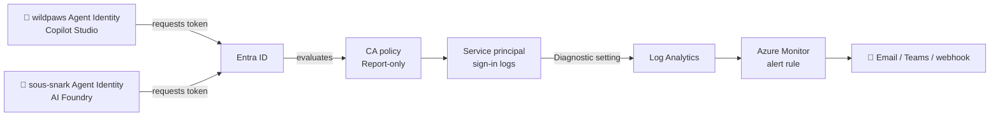
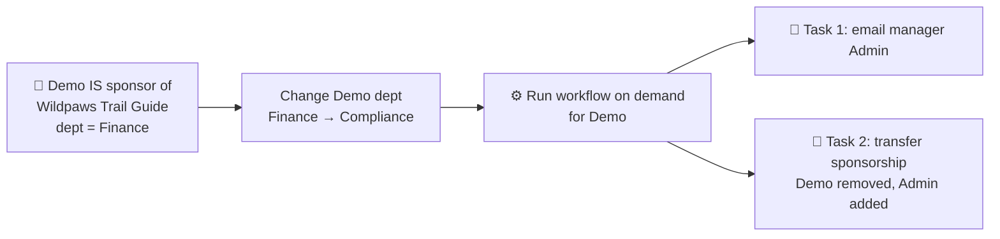

# Configure Entra for Agent 365

## Index

- [Step 1 — Create the Conditional Access policy (Report-only)](#step-1--create-the-conditional-access-policy-report-only)
- [Step 2 — Tag the agents with custom security attributes](#step-2--tag-the-agents-with-custom-security-attributes)
- [Step 3 — Notify the sponsor's manager when sponsorship changes](#step-3--notify-the-sponsors-manager-when-sponsorship-changes)
- [Step 4 — Observe the logs](#step-4--observe-the-logs)
- [Step 5 — Generate an alert you can observe](#step-5--generate-an-alert-you-can-observe)
- [Appendix — Does this apply to Copilot Studio agents?](#appendix--does-this-apply-to-copilot-studio-agents)
- [Reference](#reference)

---

## Prerequisites

---

## Step 1 — Create the Conditional Access policy (Report-only)

### What you'll build



1. Sign in to the **Microsoft Entra admin center** (`https://entra.microsoft.com`) → **Entra ID → Conditional Access → Policies → New policy**.
2. Name it: `Observe – Pilot agents access`.
3. **Assignments → Users, agents or workload identities → What does this policy apply to? → Agents**:
   - **Select agent identities** → pick **both pilot agents**: **wildpaws** and **sous-snark** (the `-AgentIdentity` SPs).
   - *Optional:* select the **agent blueprint principal(s)** instead to automatically cover every agent derived from those blueprints, including future ones.
4. **Target resources → Include → Select resources** → pick the resources the pilot agents actually call (e.g. **Microsoft Graph** and any Foundry/Power Platform APIs the two agents use). This scopes the policy to just the pilot's surface area rather than every resource in the tenant.
5. *(Optional)* **Conditions → Agent risk (Preview) → Configure = Yes** → choose `High` (and `Medium`) to fire only on risky-agent signals.
6. **Access controls → Grant → Block** — for agent identities, **Block is the only control** (no interactive remediation exists).
7. **Enable policy = Report-only** → **Create**.

> Report-only means the agent keeps working, but every token request is evaluated and logged as "would have been blocked/granted" — exactly the observability we want. Once you've confirmed the logs look right, flip the toggle to **On** to actually enforce.

---

## Step 2 — Tag the agents with custom security attributes

> **Note:** managing custom security attributes requires the **Attribute Definition Administrator** and **Attribute Assignment Administrator** roles (separate from CA admin, by design).

**Custom security attributes** are tenant-defined key/value pairs you can stamp onto each agent identity. They make the two pilot agents easy to find, filter in logs, and target dynamically in Conditional Access (so future agents tagged the same way are automatically covered).

**a. Create an attribute set** (one-time): **Entra ID → Custom security attributes → Add attribute set** → name it `AgentGovernance`.

**b. Define attributes** inside that set (**Add attribute** for each):

| Attribute | Type | Allowed values | Why it's useful |
|-----------|------|----------------|-----------------|
| `Project` | String (predefined) | `Agent365Pilot` | Groups everything in this pilot; one filter pulls both agents. |
| `Environment` | String (predefined) | `Pilot`, `Prod` | Prevents pilot agents from being mistaken for production. |

**c. Assign values to each agent:** **Entra ID → Enterprise applications → [agent's `-AgentIdentity` SP] → Custom security attributes → Add assignment**:

| Attribute | wildpaws (Copilot Studio) | sous-snark (AI Foundry) |
|-----------|---------------------------|--------------------------|
| `Project` | `Agent365Pilot` | `Agent365Pilot` |
| `Environment` | `Pilot` | `Pilot` |

> **Payoff:** once both agents carry `Project = Agent365Pilot`, you can change the Step 1 assignment from hand-picked identities to a **filter for agents** rule (`agent.Project -eq "Agent365Pilot"`), and any new pilot agent automatically inherits the policy.

---

## Step 3 — Notify the sponsor's manager when sponsorship changes

Every agent identity has a **sponsor** — the human accountable for it. When that sponsor **leaves or changes role**, the agent needs a new owner. Microsoft Entra ID Governance **Lifecycle Workflows** automate this: a built-in task emails the sponsor's **manager**, and a companion task can **reassign the sponsorship to that manager automatically**.



> **Prereqs:** Microsoft Entra **ID Governance** license, **Lifecycle Workflows Administrator** role, the sponsor user has a populated **manager** attribute, and the manager has a populated **mail** attribute.

### 3a. Assign a sponsor to the agent and set a starting department

> For this pilot we trigger the workflow **only for the `Wildpaws Trail Guide` agent**, so you only need to sponsor that one.

1. **Entra ID → Enterprise applications → [`Wildpaws Trail Guide` `-AgentIdentity` SP] → Owners/Sponsors** (agent identities expose a **Sponsors** relationship).
2. Add the test user **Demo** as the **sponsor** of **Wildpaws Trail Guide**. **Do not remove it** — the workflow needs it present.
3. Set Demo's starting department to **Finance**: **Entra ID → Users → Demo → Edit properties → Job info → Department = `Finance`** → **Save**.
4. Confirm **Demo → Manager = Admin** (same **Job info** blade) and that **Admin** has a **mail** value — the email goes to the manager.

### 3b. Build the Lifecycle Workflow from the agent-sponsor template

1. **Entra ID → ID Governance → Lifecycle Workflows → Workflows → + New workflow**.
2. Select the template **"Agent sponsor job profile change"** (tagged **Mover** / **Agents** — *"Execute sponsorship transition tasks for agent sponsor job changes"*).
3. **Basics:** name it `Notify manager – agent sponsorship change` → **Next**.
4. **Configure scope (execution conditions):** set the rule to match the **new** department value you'll change *to*:
   ```
   (department -eq "Compliance")
   ```
   *(Match the value you change **to**, not Finance — the user comes "into scope" once the change lands.)* → **Next**.
5. **Review tasks:** the template pre-loads the agent sponsorship tasks. Confirm both are present (add via **+ Add task** if needed):
   1. **Send email to manager about sponsorship changes** → emails Admin. *(Optional: customize subject/body with tokens like `{{userDisplayName}}`, `{{managerDisplayName}}`.)*
   2. **Transfer agent identity sponsorships to manager** → **automatically removes Demo and makes Admin the sponsor**.
6. **Review + create.**

### 3c. Change the department, then run the workflow on demand

For the pilot we drive the run manually after staging the attribute change:

1. **Stage the role change:** **Entra ID → Users → Demo → Edit properties → Job info → Department = `Compliance`** → **Save**. Demo now matches the workflow's `(department -eq "Compliance")` scope.
2. **Run on demand:** open the workflow → **Run on demand → Select users → Demo → Run workflow**.
3. Within a couple of minutes the tasks execute against Demo.

### 3d. Verify

1. **Workflow → Workflow history → Tasks** → both tasks show **Successful**.
2. **Admin's mailbox** receives the sponsorship-change email.
3. **wildpaws → Sponsors**: open the **Wildpaws Trail Guide** agent identity — Demo is gone and **Admin** is now the sponsor (result of task #2).

---

## Step 4 — Observe the logs

After the agents make a few calls (send wildpaws and Sous Snark a few prompts in Teams):

1. **Entra ID → Monitoring → Sign-in logs → Service principal sign-ins** tab.
2. Filter by either agent's name / app ID.
3. Open an entry → **Report-only** tab (or **Conditional Access** tab once enforced) → you'll see your policy and its result (`Report-only: would block` / `Failure` / `Success`).

---

## Step 5 — Generate an alert you can observe

**a. Route the logs to Log Analytics:**
**Entra ID → Monitoring → Diagnostic settings → + Add diagnostic setting** → check **ServicePrincipalSignInLogs** (and **RiskyServicePrincipals** if you used the agent-risk condition) → **Send to Log Analytics workspace** → pick/create a workspace.

**b. Create the alert rule:** In that Log Analytics workspace → **Alerts → New alert rule**, use a custom log-search signal with KQL like:

```kql
let pilotAgents = dynamic(["wildpaws", "sous-snark"]);
AADServicePrincipalSignInLogs
| where ServicePrincipalName has_any (pilotAgents)
    or AppId in ("<wildpaws-appId-guid>", "<sous-snark-appId-guid>")
| mv-expand ca = parse_json(ConditionalAccessPolicies)
| where ca.displayName == "Observe – Pilot agents access"
| where ca.result in ("reportOnlyFailure", "failure", "reportOnlyInterrupted")
| project TimeGenerated, ServicePrincipalName, AppId, ResourceDisplayName,
          IPAddress, policy=ca.displayName, result=ca.result
```

Set the rule to run every 5 min over the last 5 min, threshold "results > 0", and attach an **action group** (email / Teams / webhook) so you get notified whenever the policy matches either pilot agent.

---

## Appendix — Does this apply to Copilot Studio agents?

**Yes**, with important differences from Foundry hosted agents.

### Copilot Studio agents get an Entra Agent ID automatically
When **Entra Agent Identity is enabled at the environment level** (Power Platform admin center), every new Copilot Studio agent automatically receives an **Entra Agent ID** — a service principal with an "Agent" subtype, sponsored by the agent's owner. The same CA targeting pattern works (Assignments → Agents → Select agent identities).

- Legacy agents (created before March 18, 2026, or before tenant opt-in) use traditional **app registrations** instead, and can be migrated to Agent ID.
- Find the GUID in **Copilot Studio → Settings → Advanced → Metadata → "Entra Agent ID"**.

### Where to find the logs (Copilot Studio)
- **Entra ID → Monitoring → Audit/Sign-in logs**, filter **Application contains: "Copilot Studio"** + Conditional Access = `Failure`, **or**
- **App registrations → [your agent] → Overview → "Managed application in local directory"** → prefiltered CA logs for that agent.

The Diagnostic settings → Log Analytics → alert-rule pipeline (Step 5) works the same.

### Two different "CA for agents" concepts — don't confuse them
1. **CA on the agent identity** (this guide) — gates the agent's *own* token requests. Teams-only enforcement today.
2. **CA on the end user** signing into the agent — already fully enforced on all channels. If a user's CA blocks token acquisition, the Copilot Studio agent simply won't respond (blank chat / "agent unavailable").

### Copilot Studio reference
- [App registration, agent identities, and authentication for Copilot Studio](https://learn.microsoft.com/microsoft-copilot-studio/requirements-certificates-configuration-values)
- [Troubleshoot Conditional Access policy issues (Copilot Studio)](https://learn.microsoft.com/microsoft-copilot-studio/security-conditional-access)
- [Recreate Copilot Studio agents in Microsoft Entra Agent ID](https://learn.microsoft.com/entra/agent-id/migrate-copilot-studio-agents-to-agent-id)

---

## Reference

- [Conditional Access for agents](https://learn.microsoft.com/en-us/entra/identity/conditional-access/agent-id)
- [Target agent identities in Conditional Access](https://learn.microsoft.com/en-us/entra/identity/conditional-access/howto-target-agent-identities)
- [Recommended policies for autonomous agents](https://learn.microsoft.com/en-us/entra/identity/conditional-access/policy-autonomous-agents)
- [Lifecycle Workflow built-in tasks — Send email to manager about sponsorship changes](https://learn.microsoft.com/en-us/entra/id-governance/lifecycle-workflow-tasks#send-email-to-manager-about-sponsorship-changes)

