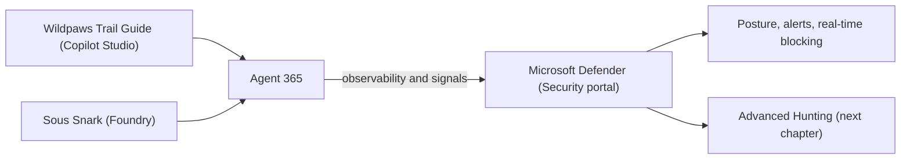

# 🛡️ Connecting Agent 365 to the Security Portal

[🏠 Back to Home](../README.md)

> To gain full visibility into your AI agents and proactively detect misconfigurations, suspicious activity, and runtime threats, you connect **Agent 365** to the **Security portal** (Microsoft Defender). Once connected, Defender treats your two pilot agents (`Wildpaws Trail Guide` and `Sous Snark`) as first-class security principals: it surfaces their posture, raises near-real-time alerts, blocks unsafe tool invocations at runtime, and feeds Agent 365 observability data into Advanced Hunting for the SOC chapters that follow.

## Index

- [What you'll build](#what-youll-build)
- [Prerequisites](#prerequisites)
- [Step 1: Enable preview features in the Defender portal](#step-1-enable-preview-features-in-the-defender-portal)
- [Step 2: Turn on Security for AI agents](#step-2-turn-on-security-for-ai-agents)
- [Step 3: Connect Agent 365 for real-time protection and investigation](#step-3-connect-agent-365-for-real-time-protection-and-investigation)
- [Step 4: Enable extended detections for the pilot agents](#step-4-enable-extended-detections-for-the-pilot-agents)
- [Step 5: Enable near-real-time detections and threat hunting](#step-5-enable-near-real-time-detections-and-threat-hunting)
- [Verify the connection](#verify-the-connection)
- [Reference](#reference)

## What you'll build



By the end of this chapter, Agent 365 is connected to Microsoft Defender so the SOC can:

- See every managed agent and its security posture in one inventory.
- Receive near-real-time alerts for suspicious agent behavior (jailbreak attempts, data exfiltration, risky executions).
- Block unsafe agent tool invocations in real time before they run.
- Query Agent 365 observability data with KQL in Advanced Hunting.

## Prerequisites

- Your organization is **onboarded to Microsoft Agent 365** (see [Chapter 4: Agent 365](../Chapter%204%20Agent%20365/Agent-365-Custom-Template.md)).
- A **Microsoft Defender** role that can change settings (for example, Security Administrator).
- The two pilot agents have been published, so they appear as managed agents.

> **Preview note:** AI agent protection in Microsoft Defender is in **Preview**. Some capabilities are currently enabled through Microsoft Defender for Cloud Apps; this is temporary and will move into the Agent 365 product experience.

## Step 1: Enable preview features in the Defender portal

1. Open the [Microsoft Defender portal](https://security.microsoft.com/).
2. Go to **System** > **Settings** > **Microsoft Defender XDR**.
3. Turn on **Preview features** so AI agent evidence shows up in alerts and incidents.

## Step 2: Turn on Security for AI agents

1. In the Defender portal, go to **System** > **Settings** > **Security for AI agents** to open the **Security for AI agents** settings page.
2. Make sure **Security for AI agents** is **toggled on**.

## Step 3: Connect Agent 365 for real-time protection and investigation

1. Still on the **Security for AI agents** settings page, find **AI real-time protection & investigation**.
2. Confirm that **Agent 365** shows as **Connected**.
3. This is the connection that lets Defender evaluate agent-initiated tool invocations (through Work IQ MCP) and block risky actions before they execute.

> Once **Agent 365** is connected, all Agent 365-managed agents, including both pilot agents, are in scope for posture, detection, and real-time protection.

## Step 4: Enable extended detections for the pilot agents

The baseline detections apply to every Agent 365-managed agent. Our two pilot agents can get an **extended** set of detections based on evaluation of model prompts and responses.

### 4a. Sous Snark (Foundry)

Enable threat protection for Foundry workloads. See [Enable threat protection for Microsoft Foundry AI workloads](https://learn.microsoft.com/azure/defender-for-cloud/ai-onboarding).

### 4b. Wildpaws Trail Guide (Copilot Studio)

Turning on extended, real-time protection for the Copilot Studio agent connects Copilot Studio to Defender. This needs two things: the **Power Platform Integration URL** that Defender gives you (the endpoint), and an **App ID** from a Microsoft Entra application that authenticates the agent to that endpoint.

1. In the Defender portal, on the **Security for AI agents** settings page, find **Copilot Studio** under **AI real-time protection & investigation** and open **Copilot Studio real-time protection**.
2. Toggle **Real-time protection** on.
3. Copy the **Enable Power Platform Integration** URL shown in the pane (for example, `https://mcsaiagents.security.core.microsoft/v1/protection`). This is the **endpoint** you need when registering the Entra app. Keep this pane open, because you paste the **App ID** back into it at the end.

#### Register the Microsoft Entra application (to get the App ID)

You can register the app with a script (recommended) or manually in the Azure portal.

**Option A: PowerShell (recommended)**

1. Download the [Create-CopilotWebhookApp.ps1](https://www.powershellgallery.com/packages/Create-CopilotWebhookApp/1.0.1) script.
2. Open Windows PowerShell as an administrator, go to the script folder, and run it, using the URL you copied as the `Endpoint`:

   ```powershell
   .\Create-CopilotWebhookApp.ps1 `
     -TenantId "<your-tenant-id>" `
     -Endpoint "https://mcsaiagents.security.core.microsoft/v1/protection" `
     -DisplayName "Copilot Studio Defender Integration" `
     -FICName "DefenderFIC"
   ```

3. The script creates the app, configures its Federated Identity Credential, and prints the **App ID**. Copy it.

**Option B: Azure portal (manual)**

1. In the [Azure portal](https://portal.azure.com/), go to **Microsoft Entra ID** > **App registrations** > **New registration**.
2. Give it a name, choose **Accounts in this organizational directory only (Single tenant)**, then select **Register**.
3. On the app's **Overview**, copy the **Application (client) ID**. This is your **App ID**.
4. Go to **Manage** > **Certificates & secrets** > **Federated credentials** > **Add credential**.
5. For **Federated credential scenario**, select **Other issuer**, then fill in:
   - **Issuer**: `https://login.microsoftonline.com/{tenantId}/v2.0` (replace `{tenantId}` with your tenant ID).
   - **Type**: **Explicit subject identifier**.
   - **Value**: `/eid1/c/pub/t/{base64-tenantId}/a/m1WPnYRZpEaQKq1Cceg--g/{base64-endpoint}` (use the encoding script below for the two base64 values).
   - **Name**: a descriptive name.
6. Select **Add**.

   Use this PowerShell to produce the base64 values for the subject, replacing the tenant ID and endpoint with your own:

   ```powershell
   # Base64-encode the tenant ID
   $tenantId = [Guid]::Parse("<your-tenant-id>")
   $base64EncodedTenantId = [Convert]::ToBase64String($tenantId.ToByteArray()).Replace('+','-').Replace('/','_').TrimEnd('=')
   Write-Output $base64EncodedTenantId

   # Base64-encode the endpoint (the Power Platform Integration URL from Defender)
   $endpointURL = "https://mcsaiagents.security.core.microsoft/v1/protection"
   $base64EncodedEndpointURL = [Convert]::ToBase64String([Text.Encoding]::UTF8.GetBytes($endpointURL)).Replace('+','-').Replace('/','_').TrimEnd('=')
   Write-Output $base64EncodedEndpointURL
   ```

#### Finish the connection

1. Back in the Defender **Copilot Studio real-time protection** pane, paste the **App ID** into the **App ID** field and select **Save**.
2. If your environment configures the provider in **Power Platform admin center** instead, go to [Power Platform admin center](https://aka.ms/ppac) > **Security** > **Threat detection** > **Additional threat detection**, pick the environment, select **Set up**, allow Copilot Studio to share data, paste the **App ID** and the **Endpoint link**, then **Save**.

## Step 5: Enable near-real-time detections and threat hunting

Near-real-time detections and Advanced Hunting rely on **Agent 365 observability data** reaching Microsoft 365 through the **Microsoft 365 app connector** in Defender for Cloud Apps. The connector pulls Microsoft 365 audit events (including agent activity) into Defender so they surface as alerts and become queryable in Advanced Hunting.

### 5a. Confirm the prerequisites

- You have a Microsoft Entra admin role that can connect apps, for example **Application Administrator** or **Cloud Application Administrator**.
- Your tenant has at least one assigned **Microsoft 365 license**.
- **Auditing is turned on** in Microsoft Purview. If it is off, open the [Microsoft Purview portal](https://purview.microsoft.com/), go to **Audit**, and select **Start recording user and admin activity**.

### 5b. Connect the Microsoft 365 app connector

1. In the [Microsoft Defender portal](https://security.microsoft.com/), select **Settings** > **Cloud Apps**.
2. Under **Connected apps**, select **App Connectors**.
3. Select **+ Connect an app**, then select **Microsoft 365**.
4. On the **Select Microsoft 365 components** page, leave **all components selected** (the default) and select **Connect**. Some detections do not work unless every required component is selected.
5. On the **Follow the link** page, select **Connect Microsoft 365**, complete the consent prompt, then select **Done**.
6. Back on the **App Connectors** page, confirm the connector status shows **Connected**. First-time data can take time to appear, so a short delay is normal.

> **Tip:** To also scan files (not required for agent detections), enable **Settings** > **Cloud Apps** > **Files** > **Enable file monitoring**.

### 5c. Make sure each agent emits observability data

- **`Wildpaws Trail Guide` (Copilot Studio):** sends observability data automatically once the Copilot Studio real-time protection from Step 4b is connected. No extra work.
- **On-Hold** **`Sous Snark` (Foundry):** emits observability data through the **Microsoft Agent 365 SDK**. Confirm the agent code initializes the SDK and that its identity has been published through Agent 365 (Chapter 4), otherwise its events will not reach the `AIAgentsInfo` table.

## Verify the connection

- On the **Security for AI agents** settings page, **Agent 365** (and, if configured, **Copilot Studio**) shows **Connected**.
- In the Defender portal, your pilot agents appear in the **AI agent inventory** with posture details.
- New agent activity begins flowing into the `CloudAppEvents` and `AIAgentsInfo` Advanced Hunting tables, which the SOC queries in the next chapter.

With Agent 365 connected to the Security portal, you are ready to put on your SOC hat and start querying the raw logs in [Analyzing Agent Logs in Advanced Hunting](../Chapter%206%20Advanced%20Hunting/Analyzing-Agent-Logs-in-Advanced-Hunting.md).

## Reference

- [Detect, block, and investigate threats to AI agents using Microsoft Defender (Preview)](https://learn.microsoft.com/defender-xdr/security-for-ai/ai-agent-detection-protection)
- [Enable external threat detection and protection for Copilot Studio custom agents (register the Entra app / App ID)](https://learn.microsoft.com/microsoft-copilot-studio/external-security-provider#register-a-microsoft-entra-application)
- [How does Microsoft Defender support Agent 365?](https://learn.microsoft.com/microsoft-agent-365/leadership/defender-agent-365)
- [Secure AI agents at scale using Microsoft Agent 365](https://learn.microsoft.com/security/security-for-ai/agent-365-security)
- [AI agent inventory in Microsoft Defender XDR](https://learn.microsoft.com/defender-xdr/security-for-ai/ai-agent-inventory)
- [Overview of Microsoft Agent 365](https://learn.microsoft.com/microsoft-agent-365/overview)

---

[🏠 Back to Home](../README.md)
