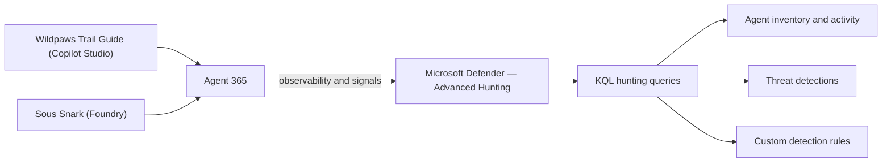

# 🔍 Analyzing Agent Logs in Advanced Hunting

[🏠 Back to Home](../README.md)

> Now that **Agent 365** is connected to Microsoft Defender (see [Chapter 5](../Chapter%205%20Security%20Portal/Connecting-Agent-365-to-the-Security-Portal.md)), agent observability data flows into **Advanced Hunting**. Acting as the **SOC**, you'll write **KQL** queries to inventory your agents, review their activity and tool invocations, and proactively hunt for suspicious behavior across the two pilot agents (`Wildpaws Trail Guide` and `Sous Snark`). When you find a query worth keeping, you'll save it and promote it to a **custom detection rule** so Defender alerts you automatically.

## Index

- [What you'll build](#what-youll-build)
- [Prerequisites](#prerequisites)
- [Step 1: Open Advanced Hunting in the Defender portal](#step-1-open-advanced-hunting-in-the-defender-portal)
- [Step 2: Inventory your agents](#step-2-inventory-your-agents)
- [Step 3: Review agent activity and tool invocations](#step-3-review-agent-activity-and-tool-invocations)
- [Step 4: Hunt for suspicious agent behavior](#step-4-hunt-for-suspicious-agent-behavior)
- [Step 5: Save queries and create custom detections](#step-5-save-queries-and-create-custom-detections)
- [Verify your hunting setup](#verify-your-hunting-setup)
- [Reference](#reference)

## What you'll build



By the end of this chapter you'll be able to:

- Query **Agent 365** and related log data with **KQL** in the Defender portal's Advanced Hunting experience.
- Build a repeatable **inventory** of your managed agents from the native `AgentsInfo` table.
- Inspect **agent and app activity** (Teams bot/app events, cloud-app actions) to see what each agent touches.
- **Hunt** for risky patterns such as brute-force sign-ins, agent threat signals, and weak agent configuration.
- Save your best queries and turn them into **custom detection rules** so the SOC is alerted automatically.

## Prerequisites

- **Chapter 5 is complete**: Agent 365 is connected to Microsoft Defender, so agent posture and signals show up in the Defender portal. See [Connecting Agent 365 to the Security Portal](../Chapter%205%20Security%20Portal/Connecting-Agent-365-to-the-Security-Portal.md).
- Both pilot agents have been **published and exercised**, so there is real activity to query. Run a few conversations through `Wildpaws Trail Guide` and `Sous Snark` first.
- A **Microsoft Defender** role that can run Advanced Hunting queries (for example, **Security Reader** to read, or **Security Operator/Administrator** to also create custom detections).
- For the identity and Office/Teams queries below (`SigninLogs`, `OfficeActivity`, and any custom `*_CL` table), your **Microsoft Sentinel workspace must be connected to the unified Microsoft Defender portal**. The native Defender tables (`AgentsInfo`, `CloudAppEvents`, alerts) work without it.

> **Where the data lives — read this first.** Advanced Hunting in the Defender portal can query two kinds of tables, and this chapter uses both:
>
> - **Native Defender XDR tables** — available directly. Most relevant here:
>   - `AgentsInfo` (Preview) — Agent 365 agent inventory and configuration. **Use this table today.**
>   - `AIAgentsInfo` (Preview) — the older Copilot Studio agent table, **being retired on July 1, 2026**; migrate to `AgentsInfo`.
>   - `CloudAppEvents`, `EntraIdSignInEvents` / `AADSignInEventsBeta`, `AlertInfo`, `AlertEvidence`, `MessageEvents` — cloud-app activity, sign-ins, alerts, and Teams messages.
> - **Microsoft Sentinel workspace tables** — available only when the workspace is connected to the unified portal: `SigninLogs`, `OfficeActivity`, and custom `*_CL` tables.

> **Preview note:** AI agent tables in Microsoft Defender are in **Preview**, so table and column names can change. Confirm the live schema in the portal's schema pane before relying on any table.

## Step 1: Open Advanced Hunting in the Defender portal

1. Open the [Microsoft Defender portal](https://security.microsoft.com/).
2. In the left navigation, go to **Hunting** > **Advanced hunting**.
3. You'll see the **query editor** at the top, the **schema/tables pane** on the left, and the **results grid** at the bottom. This is where you'll write and run all of the KQL in this chapter.

> Tip: Use the **Query resources** and **Schema reference** tabs in the left pane to browse available tables and their columns without leaving the editor.

## Step 2: Inventory your agents

Start with a baseline: which agents exist, who owns them, and who is actually using them.

**3a. Native agent inventory (`AgentsInfo`)**

`Owners` is a `dynamic` array of Entra object IDs (GUIDs), so join `IdentityInfo` to resolve them to user principal names. The `Platform != "Other"` filter focuses on agents your org built (Copilot Studio and Microsoft Foundry) and hides the long tail of third-party/marketplace agents.

```kql
// Latest snapshot per agent, owners resolved to UPNs, org-built agents only.
let OwnerLookup = materialize(
    IdentityInfo
    | distinct AccountObjectId, AccountUpn
    | where isnotempty(AccountObjectId) and isnotempty(AccountUpn));
AgentsInfo
| summarize arg_max(Timestamp, *) by AgentId
| where LifecycleStatus != "Deleted"
| where Platform != "Other"                 // drop third-party/marketplace agents; remove to see everything
| extend OwnerId = tostring(Owners[0])
| join kind=leftouter OwnerLookup on $left.OwnerId == $right.AccountObjectId
| project Name, Platform, Model, PublishedStatus, LifecycleStatus,
          OwnerUpn = AccountUpn, OwnerId, CreatedDateTime, EntraAgentID
| sort by CreatedDateTime desc
```

> **Notes:** Column names are **case-sensitive** — this schema uses `Name` (not `AgentName`) and `EntraAgentID` (capital `ID`); confirm with `AgentsInfo | getschema` if anything fails to resolve. To jump straight to the pilots, swap the `Platform` line for `| where Name has_any ("Wildpaws", "sous-snark")`.

**3b. Who is signing in to your Copilot agents (`SigninLogs`)**

```kql
// Requires the Sentinel workspace connected to the Defender portal.
SigninLogs
| where TimeGenerated > ago(30d)
| where AppDisplayName has_any ("Copilot", "Power Virtual Agents")
| summarize SignInCount = count() by UserPrincipalName, AppDisplayName, ResultType
| sort by SignInCount desc
```

> **Accuracy notes:** `has_any` is the token-based (faster) equivalent of chaining `contains ... or contains ...`. `ResultType` is a string where `"0"` means success — keep it in the grouping to separate successful sign-ins from failures at a glance. Newer `SigninLogs` rows also include an **`Agent`** column (`Agent.agentType`, `Agent.parentAppId`) for agentic sign-ins — a useful filter once it is populated in your tenant.

What to look for:

- Both pilot agents (`Wildpaws Trail Guide` and `sous-snark`) appear, resolved to the expected owner UPN.
- Owners and creation times match what you expect.
- Agents whose `OwnerId` is empty or all-zero (`00000000-0000-0000-0000-000000000000`) are **unowned** — flag them and hunt them in Step 4c.
- No unexpected or unknown agents, and no sign-ins from accounts that shouldn't be using them.

## Step 3: Review agent activity and tool invocations

Now look at what the agents and their related apps are doing in Microsoft 365 — for example, Teams bot and app install/usage events.

```kql
// Requires the Sentinel workspace connected to the Defender portal.
OfficeActivity
| where TimeGenerated > ago(30d)
| where OfficeWorkload == "MicrosoftTeams"
| where Operation has_any ("AppInstalled", "BotAddedToTeam", "MemberAdded")
| where UserId !endswith "@yourtenant.onmicrosoft.com"   // exclude your own internal users; set your domain
| project TimeGenerated, UserId, Operation, ClientIP, ExtraProperties
| sort by TimeGenerated desc
```

> **Accuracy notes:** `ExtraProperties` is a real `dynamic` column on `OfficeActivity`, and `!endswith` is valid KQL — both are correct. The original `"BotMessaged"` / `"BotAdded"` operation names are **not** standard Teams audit operations — confirm the real values in your tenant; common ones include `AppInstalled`, `BotAddedToTeam`, and `MemberAdded`. Replace `@yourtenant.onmicrosoft.com` with your actual domain (excluding `@microsoft.com` only makes sense inside Microsoft). For a native, no-Sentinel option, the equivalent activity lands in `CloudAppEvents` (Office 365 and cloud-app actions) and `MessageEvents` (Teams messages).

What to look for:

- App/bot install and membership events line up with your pilot rollout.
- The **initiator (`UserId`)** and **`ClientIP`** for each action are expected.
- No installs or additions by accounts that shouldn't have that ability.

## Step 4: Hunt for suspicious agent behavior

This is the SOC's core job: look for patterns that suggest a compromised or misbehaving agent. Keep one query per hypothesis so each stays focused and reusable.

**4a. Failed sign-in spikes / brute force against Copilot apps (`SigninLogs`)**

> [!IMPORTANT]
> **Under active test — pairing with a coworker.** I'm validating this `4a` detection with a coworker before promoting it to a custom detection rule (Step 5). Treat results as provisional until we sign off, and don't enable it for production alerting yet.

```kql
// Requires the Sentinel workspace connected to the Defender portal.
SigninLogs
| where TimeGenerated > ago(7d)
| where AppDisplayName has "Copilot"
| where ResultType != "0"            // 0 = success; anything else is a failure
| summarize FailedAttempts = count(),
            Locations  = make_set(Location),
            IPs        = make_set(IPAddress),
            ErrorCodes = make_set(ResultType)
        by UserPrincipalName, bin(TimeGenerated, 1h)
| where FailedAttempts > 10
| sort by FailedAttempts desc
```

> **Accuracy notes:** This is a solid query. The added `IPs` and `ErrorCodes` make each hit triage-ready, and the 1-hour bin with a `> 10` threshold is a reasonable brute-force signal — tune the window and threshold to your tenant's baseline.

> [!NOTE]
> **Test steps (pair with your coworker)**
>
> 1. Use a dedicated **test account** that you and your coworker are both authorized to use — don't run this against a real user's identity.
> 2. Agree on a time window, then have your coworker sign in to a **Copilot** app with the wrong password **more than 10 times within one hour** to cross the threshold.
> 3. Allow for ingestion latency — sign-in events can take roughly **15–30 minutes** to land in `SigninLogs`.
> 4. Run the 4a query and confirm the test account appears with `FailedAttempts > 10`.
> 5. Check that `IPs`, `Locations`, and `ErrorCodes` are populated and trace back to your coworker's session.
> 6. Tune `ago(7d)`, the `bin(TimeGenerated, 1h)` window, and the `> 10` threshold to your tenant's baseline, then re-run to confirm.
> 7. When the results look right, continue to **Step 5** to save the query and create the custom detection rule.

**4b. Native posture hunt — agents missing guardrail instructions (`AgentsInfo`)**

> [!IMPORTANT]
> **Under active test — pairing with a coworker.** Validating this `4b` posture hunt with a coworker before promoting it to a custom detection rule (Step 5). It currently returns **no rows** because there's no misconfigured agent to catch yet — the test below stands one up on purpose. Treat results as provisional until we sign off.

```kql
// Agents missing a system prompt (Instructions) and/or configured Guardrails are the most
// exposed to prompt-injection. Column names confirmed via `AgentsInfo | getschema`.
AgentsInfo
| summarize arg_max(Timestamp, *) by AgentId
| where LifecycleStatus == "Active"
| extend NoInstructions = isempty(Instructions) or Instructions == "N/A"
| extend NoGuardrails   = isnull(Guardrails) or tostring(Guardrails) in ("", "[]", "{}")
| where NoInstructions or NoGuardrails
| project Name, Platform, PublishedStatus, NoInstructions, NoGuardrails,
          Owners, CreatedDateTime, EntraAgentID
```

> **Accuracy notes:** Every column here is confirmed in the `AgentsInfo` schema — the usual trip-up is **casing**, since KQL is case-sensitive: `EntraAgentID` (capital `ID`), `Instructions` (plural), and `Name` (not `AgentName`). `Guardrails` is a `dynamic` column, so test it with `isnull()` plus a `tostring()` check for empty `[]` / `{}` rather than `isempty()`. The split `NoInstructions` / `NoGuardrails` flags show at a glance which guardrail an agent is missing; an empty result is a clean pass — every active agent has both.

> [!NOTE]
> **Test steps (pair with your coworker)**
>
> 1. With your coworker, spin up a **disposable test agent** in Copilot Studio or Foundry that you're both authorized to create in this tenant.
> 2. Misconfigure it on purpose — leave the **system prompt (`Instructions`) blank** and/or configure **no `Guardrails`** — then **publish** it so it lands in `AgentsInfo` with `LifecycleStatus == "Active"`.
> 3. Allow for snapshot latency — re-run the **Step 2 inventory** query until the new agent appears before testing 4b (`AgentsInfo` is a periodic snapshot, so it won't show up instantly).
> 4. Run the 4b query and confirm the test agent appears with `NoInstructions` and/or `NoGuardrails` set to `true`.
> 5. Now **add a system prompt and guardrails** to the agent, republish, wait for the snapshot to refresh, and re-run — confirm it **drops out** of the results. That proves the hunt works in both directions.
> 6. **Clean up:** delete or retire the test agent when you're done so it doesn't skew the inventory or other hunts.

**4c. Native posture hunt — unowned / orphaned agents (`AgentsInfo`)**

```kql
// "Ownerless" is only a governance gap if the agent is actually deployed. A marketplace app
// can be published to the catalog but acquired by nobody (e.g. Box: PublishedStatus="Published"
// yet acquisitionState="unacquired", acquiredStatus="acquiredForNone") — that legitimately has
// no owner and should NOT be flagged. Exclude those; keep ownerless agents that are in use.
AgentsInfo
| summarize arg_max(Timestamp, *) by AgentId
| where LifecycleStatus != "Deleted"
| extend Raw = todynamic(RawAgentInfo)
| extend OwnerId          = tostring(Owners[0])
| extend AcquiredStatus   = tostring(Raw.acquiredStatus)
| extend AcquisitionState = tostring(Raw.acquisitionState)
| extend Ownerless   = isempty(OwnerId) or OwnerId == "00000000-0000-0000-0000-000000000000"
| extend NotDeployed = AcquisitionState == "unacquired" or AcquiredStatus == "acquiredForNone"
| where Ownerless and not(NotDeployed)
| project Name, Platform, PublishedStatus, InstanceCount,
          AcquiredStatus, AcquisitionState, LifecycleStatus, CreatedDateTime, EntraAgentID
| sort by InstanceCount desc, CreatedDateTime desc
```

> **Accuracy notes:** "No owner" on its own **over-reports** — an app can be `PublishedStatus = "Published"` yet acquired by nobody (Box shows `acquisitionState = "unacquired"` / `acquiredStatus = "acquiredForNone"`), which is not a real orphan. The `NotDeployed` filter drops those. The acquisition fields live inside `RawAgentInfo` and are **empty for org-built Copilot Studio / Foundry agents**, so those are kept and still evaluated. To require active *usage* (not just acquisition), add `and InstanceCount > 0`. Acquisition strings are **preview-dependent** — confirm the exact values in your tenant before relying on them.

> Triage tip: when a row looks suspicious, pivot on the **agent identity** (or `UserPrincipalName`) to pull the full timeline of related actions before escalating.

## Step 5: Save queries and create custom detections

Turn the queries that earned their keep into reusable hunts and automated alerts.

1. With a working query in the editor, select **Save** > **Save as** to store it under **Queries** (use a clear name, e.g., `Agent 365 – Copilot failed sign-in spike`).
2. To alert automatically, select **Create detection rule** and configure:
   - **Frequency** (how often Defender runs the query).
   - **Alert title, severity, and category**.
   - **Impacted entities** (map the agent identity and initiator columns so alerts are actionable).
3. Review and **create** the rule. Defender now runs it on your schedule and raises alerts/incidents the SOC can triage.

> A query is only eligible to become a detection rule if it returns the columns Defender needs to identify entities and a timestamp. If **Create detection rule** is unavailable, adjust the query to project those columns.

## Verify your hunting setup

- [ ] `AgentsInfo` returns your agents, confirming the native schema is available (Step 2).
- [ ] `SigninLogs` / `OfficeActivity` return rows, confirming the Sentinel workspace is connected (or you've noted they're unavailable until it is).
- [ ] Step 3 shows Teams app/bot activity consistent with how the agents were rolled out.
- [ ] At least one Step 4 hunt runs and returns results (or a clean, explainable empty set).
- [ ] At least one query is **saved**, and (optionally) one **custom detection rule** is created.

## Reference

- [Advanced hunting overview (Microsoft Defender XDR)](https://learn.microsoft.com/defender-xdr/advanced-hunting-overview)
- [Data tables in the advanced hunting schema](https://learn.microsoft.com/defender-xdr/advanced-hunting-schema-tables)
- [`AgentsInfo` table (use this for Agent 365)](https://learn.microsoft.com/defender-xdr/advanced-hunting-agentsinfo-table)
- [`AIAgentsInfo` table (retiring July 1, 2026)](https://learn.microsoft.com/defender-xdr/advanced-hunting-aiagentsinfo-table)
- [Kusto Query Language (KQL) in advanced hunting](https://learn.microsoft.com/defender-xdr/advanced-hunting-query-language)
- [Work with advanced hunting query results](https://learn.microsoft.com/defender-xdr/advanced-hunting-query-results)
- [Create and manage custom detection rules](https://learn.microsoft.com/defender-xdr/custom-detection-rules)
